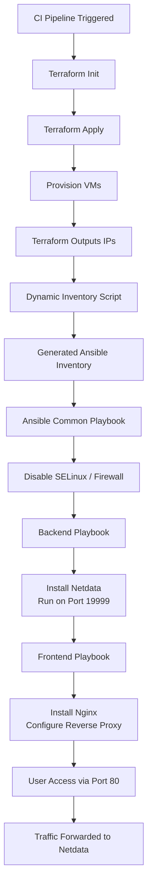

# ansible-challenge

This project demonstrates a simple Infrastructure as Code (IaC) workflow using **Terraform** and **Ansible**.

The pipeline:

1. Deploys two virtual machines using Terraform
2. Generates a dynamic inventory
3. Configures the machines using Ansible

## CI / Pipeline Repository

This repository is triggered by the following pipeline:

👉 [https://github.com/saddammohd941/ansible-challenge-pipeline.git](https://github.com/saddammohd941/ansible-challenge-pipeline.git)

## Project Objective

The automation performs the following tasks:

### **Infrastructure (Terraform)**

Provision two virtual machines:

| Hostname      | Operating System |
| ------------- | ---------------- |
| **c8.local**  | Amazon Linux     |
| **u21.local** | Ubuntu 21.04     |

### **Configuration Management (Ansible)**

After provisioning:

#### **Common Configuration (All Servers)**

* Disable SELinux (where applicable)
* Disable firewall (firewalld / UFW)

#### **Frontend (c8.local)**

* Install **Nginx**
* Configure reverse proxy:

  * Listen on **port 80**
  * Forward traffic to backend on **port 19999**

#### **Backend (u21.local)**

* Install **Netdata**
* Run Netdata on **port 19999**

## Repository Structure

```bash
ansible-challenge/
├── terraform/
│   ├── main.tf
│   ├── variables.tf
│   └── outputs.tf
├── ansible/
│   ├── inventories/
│   │   └── dynamic_inventory.sh
│   ├── group_vars/
│   │   ├── frontend.yml
│   │   └── backend.yml
│   ├── playbooks/
│   │   ├── frontend.yml
│   │   ├── backend.yml
│   │   └── common.yml
│   └── site.yml
├── ci/
│   └── pipeline.yml
└── README.md
```

## How It Works

### **1️⃣ Terraform Execution**

Terraform:

* Creates the VMs
* Outputs public IP addresses

### **2️⃣ Dynamic Inventory**

The inventory script:

* Reads Terraform outputs
* Assigns hosts to groups:

| Host      | Group    |
| --------- | -------- |
| c8.local  | frontend |
| u21.local | backend  |

### **3️⃣ Ansible Execution**

Ansible:

1. Applies common OS configuration
2. Installs Netdata on backend
3. Installs and configures Nginx on frontend

## Local Execution (Manual Testing)

### **Terraform**

```bash
cd terraform
terraform init
terraform apply -auto-approve
```

### **Ansible**

```bash
cd ansible

ansible-playbook -i inventories/dynamic_inventory.sh playbooks/common.yml
ansible-playbook -i inventories/dynamic_inventory.sh playbooks/backend.yml
ansible-playbook -i inventories/dynamic_inventory.sh playbooks/frontend.yml
```

## Network Requirements

Ensure the security group allows:

* **22** → SSH
* **80** → Nginx
* **19999** → Netdata

## Key Notes

✔ Dynamic inventory removes the need for static IP management
✔ Terraform handles infrastructure lifecycle
✔ Ansible handles configuration lifecycle
✔ Pipeline enables full automation

## Architecture / Workflow


